# TraqHACCP — Guide utilisateur

**Registre sanitaire numérique · Pâtisserie · version 4.0-registre**

Application : **[https://traqhaccp.vercel.app](https://traqhaccp.vercel.app)**
Référentiel : Règlement (CE) n° 852/2004 — Arrêté du 21 décembre 2009 — Note de service DGAL/SDSSA/2010-8075 — Arrêté du 26 juin 1986 (huiles de friture) — Guide de bonnes pratiques d'hygiène.

Ce guide s'adresse à toute personne qui utilise l'application au quotidien : gérant, chef pâtissier, pâtissier, apprenti, extra. Il décrit **uniquement ce que l'application fait réellement** : chaque écran, chaque bouton, chaque étape, du premier paramétrage au contrôle de la DDPP.

> **Lecture conseillée** — Gérant : chapitres 3, 4, 10 et 14. Équipe en production : chapitres 5, 6, 7, 8 et 9 (routine quotidienne). Contrôle sanitaire : chapitres 12 et annexe A.

> **À propos des captures d'écran** — Toutes les illustrations de ce guide présentent un **registre d'exemple** appartenant à un établissement fictif (produits, fournisseurs, clients et historique d'un jeu de démonstration pédagogique). Les écrans de votre établissement afficheront vos propres données, et un registre nouvellement créé démarre vide.

---

## Sommaire

1. À quoi sert TraqHACCP
2. Installer l'application sur le poste de travail
3. Compte, connexion et mode de démonstration
4. Premier paramétrage de l'établissement (10 minutes)
5. Se repérer : l'anatomie de l'écran principal
6. La routine quotidienne en trois passes
7. Réception d'une marchandise dans le registre
8. DLC secondaires et témoins sanitaires
9. Ventes et déstockage FIFO
10. Fiches coût, recettes et marges
11. Saisie assistée : scan d'étiquette et ajustement d'inventaire
12. Contrôle sanitaire DDPP et enquête de traçabilité
13. Équipe, rôles et codes PIN
14. Les réglages de l'établissement (8 onglets)
15. Couleurs, statuts et alertes
16. Sauvegarde, restauration et usage hors connexion
17. Dépannage : les 10 questions les plus fréquentes
18. Ce que cette version ne fait pas encore
- Annexe A — Référentiel réglementaire et seuils livrés
- Annexe B — Glossaire métier
- Annexe C — Mémo d'une page à afficher en laboratoire

---

## 1. À quoi sert TraqHACCP

TraqHACCP remplace le classeur sanitaire papier par un registre numérique que l'on remplit **en même temps que l'on travaille**. Trois choses, et trois seulement, sont à retenir :

- **Chaque marchandise reçue devient un lot tracé** : fournisseur, numéro de lot fabricant, quantité, prix, température relevée, DLC fabricant.
- **Chaque préparation sortie du labo reçoit sa DLC secondaire**, calculée automatiquement selon le barème du guide de bonnes pratiques (J+1, J+2, J+3, J+5), avec échantillon témoin si la préparation est sensible.
- **Chaque vente devient une preuve nominative** : qui a produit, qui a vendu, à quel client, à quelle heure, avec quels lots déstockés. En cas d'alerte rappel produit, l'application remonte en un clic la liste des clients à rappeler.

Trois bénéfices mesurables au quotidien :

- Le **coût matière et la marge** de chaque pâtisserie sont affichés en direct (food cost, coefficient multiplicateur), calculés sur les prix d'achat réellement enregistrés à la réception.
- La **sortie de stock est automatique** : vendre un gâteau déstocke les bonnes quantités des bons lots, en commençant par la DLC la plus courte (FIFO), donc moins de pertes.
- En **contrôle DDPP**, l'inspecteur consulte un registre horodaté et nominatif au lieu d'un cahier à reconstituer.

**Ce dont vous avez besoin** : un ordinateur, une tablette ou un téléphone récent, un navigateur (Chrome, Edge, Safari, Firefox), et le réseau du laboratoire. L'application fonctionne aussi hors connexion après la première ouverture.

---

## 2. Installer l'application sur le poste de travail

### 2.1 Sur ordinateur (laboratoire ou bureau)

1. Ouvrez **Chrome** ou **Edge** et allez sur **[https://traqhaccp.vercel.app](https://traqhaccp.vercel.app)**.
2. Connectez-vous (chapitre 3).
3. Menu du navigateur → **Réglages** → onglet **Préférences** → encadré « Application » → **Installer**.
   *(L'installation ajoute un raccourci plein écran, sans barre d'adresse, et met l'application en cache pour l'usage hors connexion.)*
4. Le raccourci apparaît sur le bureau et dans le menu démarrer : cliquez dessus comme sur n'importe quel logiciel.

### 2.2 Sur tablette ou téléphone (poste de production, salle de vente)

1. Ouvrez l'URL dans **Safari** (iPhone/iPad) ou **Chrome** (Android).
2. **iPhone / iPad** : bouton *Partager* → **Sur l'écran d'accueil**.
   **Android** : menu ⋮ → **Ajouter à l'écran d'accueil** / **Installer l'application**.
3. Une icône TraqHACCP est créée : l'application s'ouvre en plein écran, comme une application native.

### 2.3 Mode sombre et sons

- Le bouton **soleil/lune** en haut à droite bascule entre le thème *Papier* (clair, pour le contrôle en salle) et le thème *Nuit* (service du soir).
- Le **bip de validation** à chaque enregistrement se coupe dans **Réglages → Préférences** (« Sons de validation »).

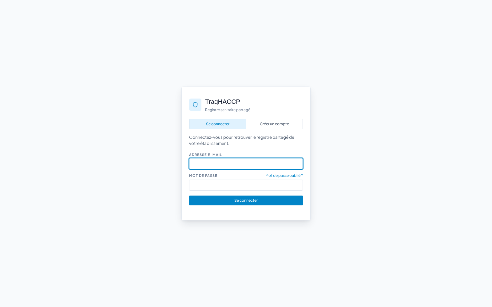

---

## 3. Compte, connexion et mode de démonstration

Au premier lancement, l'application affiche l'écran **TraqHACCP — Registre sanitaire partagé**. Il propose deux chemins.

### 3.1 Créer le compte de l'établissement (recommandé)

1. Onglet **Créer un compte**.
2. Renseignez : **Nom de l'établissement**, **Adresse e-mail**, **Mot de passe** (8 caractères minimum), **Confirmation du mot de passe**.
3. Validez. Le compte est créé et l'application propose de se connecter avec ces identifiants.

> Le compte est rattaché à **un établissement**. Deux appareils connectés au même compte voient le **même registre** : c'est le mode *registre partagé* (laboratoire + bureau + caisse).

### 3.2 Se connecter

1. Onglet **Se connecter** : adresse e-mail + mot de passe → **Se connecter**.
2. La session reste ouverte sur l'appareil. Pour la fermer : **icône Réglages → onglet Compte → Fermer la session**.

### 3.3 Mot de passe oublié

Lien **Mot de passe oublié ?** sous le formulaire : saisissez l'adresse e-mail du compte, un message de réinitialisation est envoyé. Le nouveau mot de passe doit respecter la même règle (8 caractères minimum).

### 3.4 Un compte est obligatoire (l'application est en mode connecté)

L'application livrée fonctionne **exclusivement en mode connecté** : sans compte, aucun écran de travail ne s'ouvre. Il n'existe pas de mode « démonstration » ni de mode « hors compte ».

Un établissement **nouvellement créé démarre avec un registre vide** — sans lot, sans recette, sans brigade. C'est normal : les écrans se remplissent au fil des réceptions et des préparations (chapitres 6 à 9). Pour visualiser à quoi ressemble un registre rempli, ce guide contient des captures d'écran d'exemple (voir l'encadré en tête de document).

> ⚠️ **À savoir** — Les données saisies sont conservées **dans le navigateur de l'appareil utilisé**, rattachées à l'identifiant de l'établissement. Vider les données du navigateur efface le registre : exportez régulièrement votre archive (chapitre 16). La synchronisation automatique entre plusieurs postes n'est pas encore active dans cette version (chapitre 18).

### 3.5 Changer d'établissement / se déconnecter

En haut de l'écran, le bouton **Établissement** ouvre la gestion du compte : changer d'établissement (les données de l'établissement choisi sont rechargées) ou fermer la session.

---

## 4. Premier paramétrage de l'établissement (10 minutes)

À faire une seule fois, à la mise en service, dans l'ordre. Tout se passe dans **Réglages** (icône engrenage, en haut à droite).

| Étape | Où | Ce qu'il faut saisir |
| --- | --- | --- |
| 1 | Réglages → **Établissement** | Nom de l'établissement, activité déclarée, SIRET, n° d'agrément sanitaire, adresse, code postal, ville, téléphone, courriel, responsable légal, nombre de couverts, année de mise en service → **Enregistrer la fiche** |
| 2 | Réglages → **Équipements** | Vérifier le parc livré (8 enceintes par défaut) : chambre froide positive, armoire réfrigérée, congélateur négatif, vitrine pâtissière, cellule de refroidissement, bain-marie de service, armoire chauffante, chambre froide légumes. Renommer selon le laboratoire, **Suspendre**/**Retirer** un appareil, ou **Déclarer l'équipement** |
| 3 | Réglages → **Normes & seuils** | Le référentiel réglementaire est prérempli. Ne modifiez que si votre analyse de dangers le justifie : un seuil plus permissif que le socle obligatoire est **refusé** à l'enregistrement |
| 4 | Réglages → **Durées de vie** | Contrôler les 4 familles et leurs paliers : *Préparations ultra-sensibles* J+1, *Viandes et poissons décongelés* J+2, *Standard cuisiné traiteur* J+3, *Semi-conserve pasteurisée sous-vide* J+5 (uniquement si la pasteurisation est validée au dossier) |
| 5 | Réglages → **Alertes** | Horizon des dates limites (24 h / 2 j / 3 j / 1 semaine), **Rappel à l'ouverture**, **Heures calmes**, et **Demander** l'autorisation de notification → **Enregistrer les alertes** |
| 6 | Réglages → **Préférences** | Thème, sons, unité de température (°C ou °F), rythme du rappel de sauvegarde → **Enregistrer les préférences** |
| 7 | **Équipe & Utilisateurs** | Ajouter chaque membre de la brigade avec son **rôle** et son **code PIN** (chapitre 13) |
| 8 | Réglages → **Données & sauvegardes** | Cliquer **Télécharger** une première fois pour vérifier que l'export du registre fonctionne bien sur cet appareil |

> **Conseil** — Faites ce paramétrage sur l'ordinateur du bureau, pas sur le téléphone : les champs sont longs et la fiche d'établissement sert d'en-tête à tous les documents remis au contrôle.

---

## 5. Se repérer : l'anatomie de l'écran principal

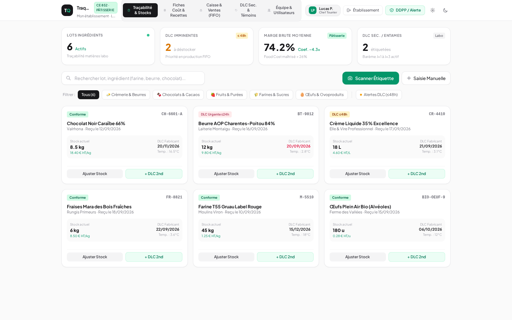

### 5.1 La barre supérieure

- **TraqHACCP · CE 852** — l'identité du registre ; le nom de l'établissement s'affiche juste en dessous.
- **Les 5 onglets** : *Traçabilité & Stocks*, *Fiches Coût & Recettes*, *Caisse & Ventes (FIFO)*, *DLC Sec. & Témoins*, *Équipe & Utilisateurs*, puis l'icône **Réglages**.
- **Opérateur en service** (initiales affichées, ex. « LP Lucas Perez — Chef Tourrier ») : tous les enregistrements sont signés à ce nom. Cliquez pour changer d'opérateur.
- **Établissement** : compte et changement d'établissement.
- **DDPP / Alerte** : ouvre l'espace de contrôle sanitaire et l'enquête de traçabilité descendante (chapitre 12).
- **Réglages** puis le bouton **thème clair / sombre**.

Sur téléphone et tablette verticale, les 5 onglets passent en **barre tactile en bas d'écran** — mêmes écrans, mêmes fonctions.

### 5.2 Les 4 indicateurs (en haut de l'écran)

- **Lots Ingrédients** — nombre de lots actifs suivis dans le laboratoire (« Actifs »).
- **DLC Imminentes ≤ 48 h** — nombre de lots à déstocker en priorité en production FIFO.
- **Marge Brute Moyenne** — marge brute moyenne de la carte, avec le coefficient multiplicateur moyen.
- **DLC Sec. / Entamés** — nombre de préparations et produits entamés porteurs d'une DLC secondaire.

Ces indicateurs se recalculent à chaque enregistrement : c'est le tableau de bord du service.

### 5.3 Vocabulaire des statuts (chapitre 15 pour le détail)

- 🟢 **Conforme** — lot dans les normes, aucune échéance proche.
- 🟠 **DLC ≤ 48 h** — à écouler en priorité.
- 🔴 **DLC Urgente ≤ 24 h** — à traiter aujourd'hui.
---

## 6. La routine quotidienne en trois passes

L'application se remplit en trois moments courts. Ce découpage est celui des inspecteurs : *ce qui entre, ce qui est préparé, ce qui sort*.

### Passe 1 — À la livraison (3 à 5 minutes, à chaque réception)

1. **Traçabilité & Stocks** → **Saisie Manuelle** (ou **Scanner Étiquette**).
2. Un formulaire par marchandise reçue : catégorie, fournisseur, désignation, numéro de lot fabricant, quantité + unité, prix d'achat HT, **température relevée au thermomètre**, DLC fabricant.
3. **Valider et Entrer en Stock**. Le lot apparaît aussitôt dans la liste, signé du nom de l'opérateur en service.

### Passe 2 — À la production (1 minute par préparation)

1. **DLC Sec. & Témoins** → **Nouvelle DLC Secondaire** : rattachez la préparation à son lot matière première, choisissez le type d'opération, la DLC se calcule automatiquement.
2. Pour les crèmes pâtissières, ganaches et préparations sensibles servies au client : **Enregistrer Échantillon** (100 g, 5 jours à +3 °C).
3. À la vente, **Caisse & Ventes** → **Vendre & Déstocker** : le stock part du plus ancien lot (FIFO) et la ligne de vente est créée.

### Passe 3 — En fin de service (5 minutes)

1. **Traçabilité & Stocks** → filtre **Alertes DLC (≤48 h)** : ce qui doit être écoulé demain.
2. **Caisse & Ventes** : contrôlez l'historique du jour (montants, marges, clients).
3. **Réglages → Données & sauvegardes** → **Télécharger** : une archive JSON par semaine minimum (le rythme du rappel se règle dans *Préférences*).

> **Astuce** — L'application affiche au premier écran du service un **résumé des lots urgents** (option *Rappel à l'ouverture*, activée par défaut) : on ouvre TraqHACCP, on sait quoi écouler en priorité.

---

## 7. Réception d'une marchandise dans le registre

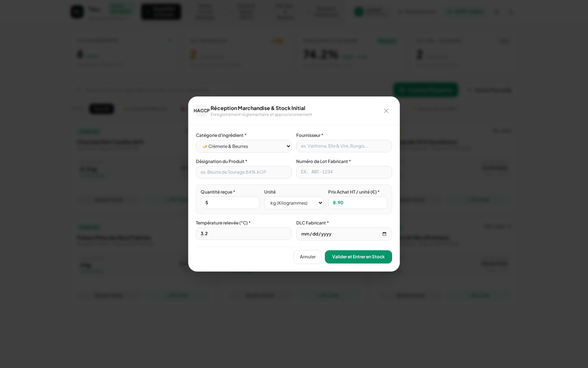

C'est l'enregistrement **le plus important du registre** : tout le reste (DLC secondaires, ventes, rappels, food cost) en découle.

### 7.1 Ouvrir le formulaire

- **Traçabilité & Stocks** → bouton **Saisie Manuelle** (clavier), ou
- bouton **Scanner Étiquette** (saisie assistée, chapitre 11).

### 7.2 Les champs du formulaire

| Champ | Obligatoire | Ce qu'on y met |
| --- | --- | --- |
| **Catégorie d'ingrédient** | oui | 🧈 Crèmerie & Beurres · 🍫 Chocolats & Cacaos · 🍓 Fruits & Purées · 🌾 Farines & Sugres · 🥚 Œufs & Ovoproduits |
| **Fournisseur** | oui | Nom du fournisseur livrant (ex. Valrhona, Laiterie Montaigu, Rungis Primeurs) |
| **Désignation du Produit** | oui | Libellé lisible (ex. « Beurre AOP Charentes-Poitou 84% ») |
| **Numéro de Lot Fabricant** | oui | Le code porté sur l'étiquette du fournisseur : il servira à remonter les clients en cas d'alerte |
| **Quantité reçue** + **Unité** | oui | kg (kilogrammes), L (litres) ou u (unités / œufs) |
| **Prix Achat HT / unité (€)** | oui | Prix HT payé pour l'unité choisie : c'est lui qui alimente les calculs de food cost |
| **Température relevée (°C)** | oui | Relevé au thermomètre à la livraison — le seuil réglementaire dépend de la famille du produit |
| **DLC Fabricant** | oui | Date limite portée par le fournisseur |

La **date de réception est enregistrée automatiquement** (jour de la saisie) : elle n'est pas à ressaisir.

> **Précision réglementaire** — Le contrôle de chaîne du froid se fait **à réception**. Un relevé supérieur au seuil ne doit pas être passé sous silence : notez la valeur telle qu'elle est lue, refusez la marchandise si elle est hors seuil et signalez-le au fournisseur. Le rapport d'inspection de l'application calcule le taux de respect de ce point (« Respect chaîne du froid réceptions < +4 °C crèmerie »).

### 7.3 Valider

**Valider et Entrer en Stock**. Le lot est créé avec un statut **Conforme** et apparaît en tête de la liste.

### 7.4 Exemple complet (cas réel)

> Livraison du 25/09/2026, 7 h 40 — Crème Liquide 35% Excellence (Elle & Vire Professionnel), lot fabricant `CR-4410`, 18 L à 4,60 € HT/L, relevée à **+3,1 °C**, DLC fabricant 21/09/2026.
> Saisie : catégorie *Crèmerie & Beurres*, quantité `18` + unité `L`, prix `4.60`, température `3.1`, DLC `2026-09-21` → **Valider et Entrer en Stock**.
> Résultat : la fiche lot affiche « Stock actuel 18 L · 4.60 € HT/L · Temp. : 3.1 °C », avec le badge d'échéance calculé automatiquement.

### 7.5 Filtres et lecture de la liste des lots

- **Filtrer : Tous (n)** — ou par catégorie (🧈, 🍫, 🍓, 🌾, 🥚) pour retrouver une matière rapidement.
- **Alertes DLC (≤48h)** — vue de travail du responsable : uniquement les lots à écouler.
- Chaque carte de lot affiche : le code lot, la désignation, le fournisseur, la date de réception, le **stock actuel**, le **prix HT/unité**, la **DLC fabricant**, la **température relevée**, et deux actions : **Ajuster Stock** et **+ DLC 2nd**.

---

## 8. DLC secondaires et témoins sanitaires

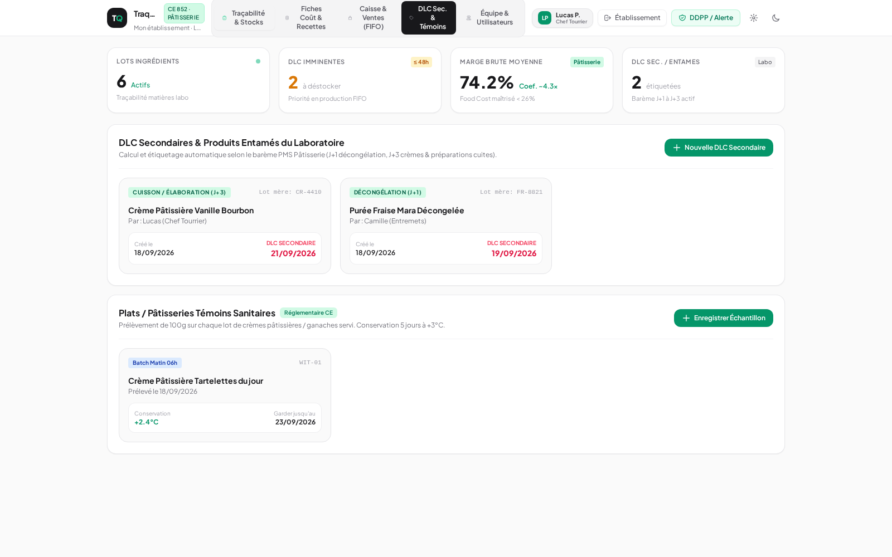

Un produit fini ne porte pas la DLC de sa matière première : quand on entame un pot, quand on décongèle une purée ou quand on cuit une crème, **une nouvelle DLC démarre**. C'est le rôle de cet onglet.

### 8.1 Créer une DLC secondaire

1. **DLC Sec. & Témoins** → **Nouvelle DLC Secondaire**.
2. **Rattacher au Lot Matière Première** : choisissez le lot d'origine (la traçabilité remontera jusqu'à lui).
3. **Désignation de la Préparation** : ex. « Crème Pâtissière Vanille Bourbon », « Purée Fraise Mara Décongelée ».
4. **Type d'opération** — c'est lui qui fixe le barème :

| Type d'opération | Paller appliqué | Exemples |
| --- | --- | --- |
| **Décongélation purée/fond** | **J+1** | Purée ou fonds décongelés en enceinte réfrigérée |
| **Entame emballage** | **J+3** | Pot de crème, chocolat, purée entamés et refermés |
| **Cuisson / Crème cuite** | **J+3** | Crème pâtissière, ganache cuite, appareil cuit |
| **Sous-vide** | **J+5** | Semi-conserve pasteurisée sous-vide **uniquement** si le couple temps/température est validé au dossier |

5. **DLC Secondaire Calculée** : la date est préremplie par le barème (date de fabrication + palier). Elle reste modifiable pour un cas particulier documenté — une DLC **raccourcie** est toujours acceptée, un allongement au-delà de J+3 doit être justifié par une analyse de dangers.
6. Validez : la DLC est enregistrée et signée du nom de l'opérateur en service (ex. « Par : Lucas (Chef Tourrier) »).

> Le palier des familles est réglable dans **Réglages → Durées de vie**. Le texte du guide de bonnes pratiques y est rappelé : *J+1 pour les préparations ultra-sensibles, J+2 pour les viandes et poissons décongelés, J+3 pour le standard cuisiné*.

### 8.2 Enregistrer un échantillon témoin

Pour toute crème pâtissière, ganache ou préparation sensible servie au client, la réglementation impose de conserver un **échantillon témoin**.

1. Encadré **Plats / Pâtisseries Témoins Sanitaires** → **Enregistrer Échantillon**.
2. Renseignez : **Désignation de la Pâtisserie / Crème**, **Service / Fournée** (ex. « Batch Matin 06h »), **Température enceinte (°C)** du lieu de conservation.
3. **Enregistrer Témoin**.

Le témoin est créé avec sa référence (ex. `WIT-01`), sa date de prélèvement, sa température et sa **date de fin de conservation automatique** : prélevé le 18/09, conservé 5 jours → « Garder jusqu'au 23/09/2026 ». La règle livrée est : **prélèvement de 100 g, conservation 5 jours à +3 °C**.

> Le taux de couverture des témoins apparaît dans le rapport d'inspection DDPP (point 3 du contrôle). Un lot de crème servi sans témoin apparaît comme « Aucun témoin » : à corriger le jour même.

---

## 9. Ventes et déstockage FIFO

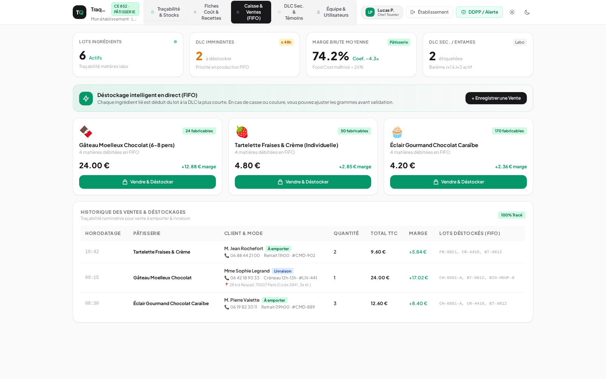

Cet écran fait deux choses en un seul geste : il **enregistre la vente** (avec la preuve nominative du client) et il **déstocke les matières premières** au gramme près, en partant de la DLC la plus proche.

### 9.1 Vendre une pâtisserie de la carte

1. Onglet **Caisse & Ventes (FIFO)**.
2. Repérez la pâtisserie (le nombre de **fabricables** possibles est affiché sur la vignette) → **Vendre & Déstocker**.
3. La modale **Validation du Déstockage Ingrédients** s'ouvre : elle liste les ingrédients qui vont être déduits, **dans l'ordre FIFO** (DLC la plus proche d'abord), avec le lot utilisé pour chacun.
4. Complétez l'identification du client (chapitre 9.3) puis validez.

### 9.2 Enregistrer une vente hors carte (plusieurs produits, commande)

**+ Enregistrer une Vente** permet de saisir une commande complète : pâtisserie sélectionnée, **quantité vendue**, canal, client, et même **d'ajuster les grammages** en cas de casse ou de coulure avant validation. Le total TTC et la marge sont recalculés automatiquement.

### 9.3 Les champs du déstockage

| Champ | Obligatoire | Usage |
| --- | --- | --- |
| **Canal de vente** | oui | 🛍️ Vente à emporter / Retrait — 🛵 Livraison à domicile / Entreprise |
| **Nom du client ou société** | oui | Identifie la personne à rappeler en cas d'alerte sanitaire |
| **Téléphone portable** | oui | Le rappel sanitaire se fait par téléphone : l'application permet de copier tous les numéros d'un lot en un clic |
| **Heure de retrait & Réf. Commande** | recommandé | Ex. « Retrait 11h00 · #CMD-902 » |
| **Adresse de livraison & Digicode** | si livraison | Ex. « 28 bd Raspail, 75007 Paris (Code 2841, 3e ét.) » |

### 9.4 Historique des ventes et déstockages

Le tableau du bas conserve, pour chaque vente : **horodatage**, **pâtisserie**, **client & mode** (avec téléphone, heure de retrait ou créneau de livraison, référence), **quantité**, **total TTC**, **marge**, et surtout la **liste des lots déstockés (FIFO)**.

C'est cette dernière colonne qui rend l'enquête sanitaire possible : elle relie définitivement un client à un numéro de lot fabricant.

> **Règle FIFO** — On déstocke toujours le lot dont la DLC est la plus proche. C'est le meilleur moyen de réduire les pertes et de justifier une gestion irréprochable en contrôle : l'application applique cette règle automatiquement, elle ne demande pas de la connaître.
---

## 10. Fiches coût, recettes et marges

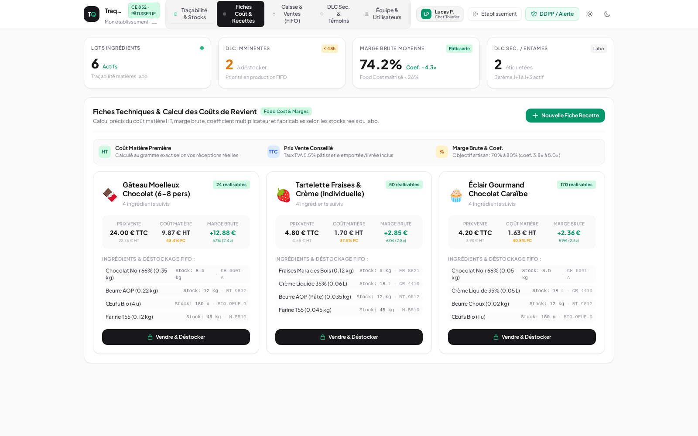

Cet onglet est le **tableau de bord économique** de la carte. Il ne se contente pas d'afficher des prix : il calcule le **coût matière réel** à partir des prix d'achat que vous avez enregistrés à la réception, et du **stock réel** du laboratoire.

### 10.1 Comment lire une fiche

Pour chaque pâtisserie, la carte affiche :

- **PRIX VENTE** en TTC et en **HT** (le taux de TVA appliqué par défaut est celui de la pâtisserie emportée/livrée : **5,5 %**).
- **COÛT MATIÈRE HT** — somme des ingrédients au gramme exact, valorisés au prix de réception.
- **FC (Food Cost)** — part de la matière première dans le prix de vente HT, en pourcentage. Repère métier : **un food cost maîtrisé se situe autour de 25 à 35 %**.
- **MARGE BRUTE** en euros et en pourcentage, avec le **coefficient multiplicateur** entre parenthèses. Objectif artisan affiché par l'application : **70 % à 80 % de marge brute, soit un coefficient de 3,8x à 5,0x**.
- **X réalisables** — nombre de pièces encore fabricables avec les stocks actuels, et **X ingrédients suivis**.
- **INGRÉDIENTS & DÉSTOCKAGE FIFO** — pour chaque matière : grammage, stock disponible et **numéro de lot** qui sera déstocké.

### 10.2 Utiliser une fiche pour décider

Trois usages concrets :

1. **Avant de fixer un prix** : ouvrez la fiche, regardez le food cost. Au-delà de 40 %, la pâtisserie travaille pour payer ses matières premières.
2. **Quand un prix fournisseur augmente** : la fiche se met à jour automatiquement dès que vous saisissez la nouvelle réception au nouveau prix — vous voyez immédiatement l'impact sur la marge, sans rien recalculer.
3. **Avant de lancer une fournée** : le nombre de **réalisables** vous dit ce que le stock permet réellement.

### 10.3 Vendre depuis une fiche

Le bouton **Vendre & Déstocker** en bas de fiche lance exactement la même opération que depuis l'onglet Caisse : le bon de vente, le client et le déstockage FIFO (chapitre 9).

### 10.4 Créer une nouvelle fiche recette

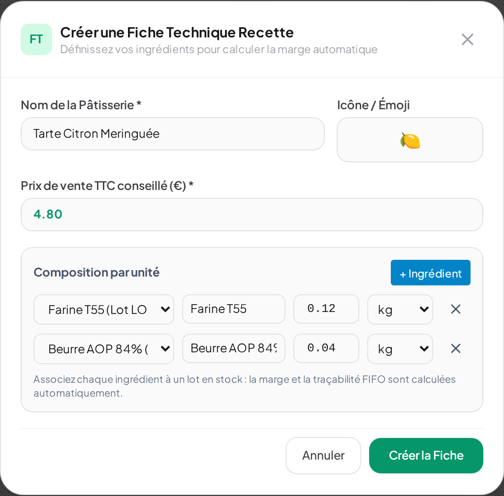

Le bouton **Nouvelle Fiche Recette**, en haut de l'onglet, ouvre la modale **Créer une Fiche Technique Recette**. Aucune connaissance comptable n'est requise : le coût matière, le food cost et la marge sont calculés par l'application à partir des **lots réellement en stock**.

1. **Nom de la Pâtisserie** *(obligatoire)* — le nom tel qu'il apparaîtra sur la carte.
2. **Icône / Émoji** — la vignette affichée sur la carte (ex. 🍋, 🍓).
3. **Prix de vente TTC conseillé (€)** *(obligatoire)* — le prix de vente public ; l'application en déduit le HT, puis le food cost et la marge.
4. **Composition par unité** → bouton **+ Ingrédient**, une ligne par matière première :
   - **Associer au lot FIFO…** — choisissez le lot à déstocker : le **nom de l'ingrédient** et son **unité** se remplissent automatiquement (c'est le lot qui sera déstocké en caisse, chapitre 9) ;
   - **Nom ingrédient** — corriger si besoin ;
   - **Qté** — la quantité pour **une seule pièce** (ex. `0.12` pour 120 g) ;
   - **Unité** — kg, L ou u ;
   - **✕** — retire la ligne ajoutée par erreur. La **dernière ligne ne peut pas être supprimée** : le formulaire conserve toujours une ligne de saisie disponible.
5. Répétez **+ Ingrédient** pour chaque ingrédient de la recette, puis **Créer la Fiche**.

La fiche rejoint immédiatement la carte, avec son coût matière, son food cost et sa marge calculés, et elle est **aussitôt vendable depuis la Caisse**.

> 💡 **Seules les lignes complètes sont enregistrées** — une ligne sans lot, sans nom d'ingrédient ou avec une quantité égale à 0 est ignorée à l'enregistrement. Un ingrédient non rattaché à un lot ne peut pas être déstocké : il ne peut donc pas entrer dans le calcul de la marge.
> 💡 **Pas de lot en stock ?** Créez d'abord la réception du lot (chapitre 7) : la liste déroulante ne propose que des lots existants. Pour une recette de travail sans déstockage, utilisez un lot de référence et ajustez son stock (chapitre 11.2).

---

## 11. Saisie assistée : scan d'étiquette et ajustement d'inventaire

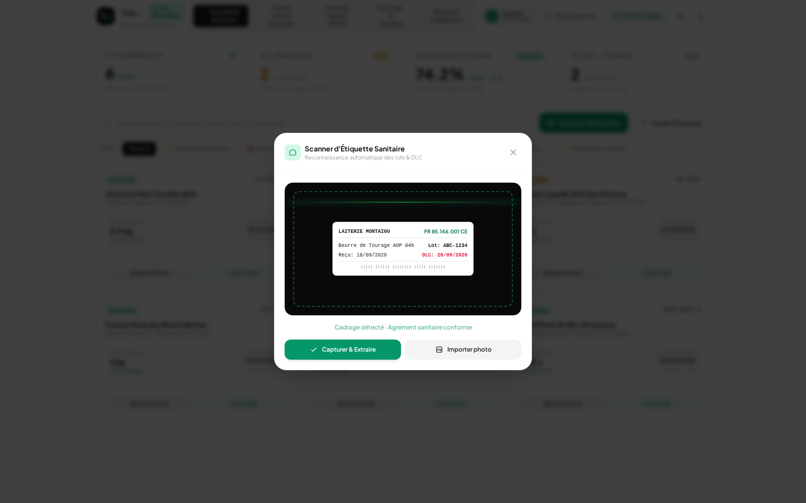

### 11.1 Scanner une étiquette (reconnaissance automatique)

**Traçabilité & Stocks → Scanner Étiquette** ouvre le module de reconnaissance d'étiquette fournisseur. Le parcours :

1. **Prendre photo** mobilise l'appareil photo du poste (tablette ou téléphone) ; **Importer photo** prend une image déjà présente sur l'appareil.
2. L'application **compresse la photo** (1 280 px de côté au maximum) puis l'envoie au service d'analyse d'images. Un voile « **Analyse IA de l'étiquette…** — *Extraction du lot, de la DLC et du produit* » s'affiche pendant le traitement.
3. Le **formulaire de réception s'ouvre pré-rempli** avec ce que porte l'étiquette : désignation du produit, fournisseur, **numéro de lot**, **DLC** et **catégorie HACCP**. Un message confirme : « *Étiquette reconnue par IA — vérifiez les champs*. »
4. **Relisez et corrigez** — en priorité le numéro de lot et la DLC — puis **Valider et Entrer en Stock** (chapitre 7).

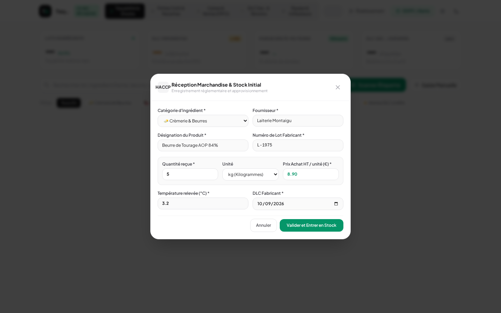

> ⚠️ **L'IA propose, l'utilisateur valide.** Une photo de biais, un reflet, une étiquette froissée ou une écriture effacée donnent une extraction incomplète ou erronée. **Le registre engage l'établissement : aucune donnée d'étiquette n'est enregistrée sans relecture humaine.**

> ⓘ **État de l'installation** — la reconnaissance automatique suppose une **clé d'analyse d'images configurée sur le serveur**. Tant qu'elle ne l'est pas (chapitre 18), l'appui sur **Prendre photo** affiche « *Information : Clé API Gemini non configurée sur le serveur…* » et le formulaire s'ouvre **vide** : la saisie manuelle (chapitre 7) reste la méthode de travail. Le lien **Tester avec l'étiquette de démonstration** déroule tout le parcours sur une étiquette d'exemple ; les valeurs alors proposées sont des valeurs de démonstration, **à ne jamais conserver pour un lot réel**.

### 11.2 Ajuster le stock d'un lot (inventaire)

Après une casse, une coulure, un vol, un écart de pesée ou une erreur de saisie, on corrige le stock réel. **Deux méthodes** :

1. **Depuis la fiche du lot** : carte du lot → **Ajuster Stock** → *Nouveau stock réel pesé* → **Enregistrer**. L'ajustement est nominatif et daté.
2. **Depuis une vente** : dans la modale de déstockage, ajustez les grammages au besoin avant validation (cas de la casse en fin de service).

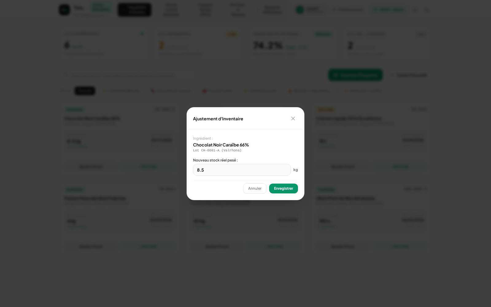

> **Bonne pratique** — Ajustez **le jour même**, avec le motif en tête (casse, coulure, dégustation, écart fournisseur). Un inventaire corrigé le jour même ne se discute pas en contrôle ; un écart découvert quinze jours plus tard, si.

---

## 12. Contrôle sanitaire DDPP et enquête de traçabilité

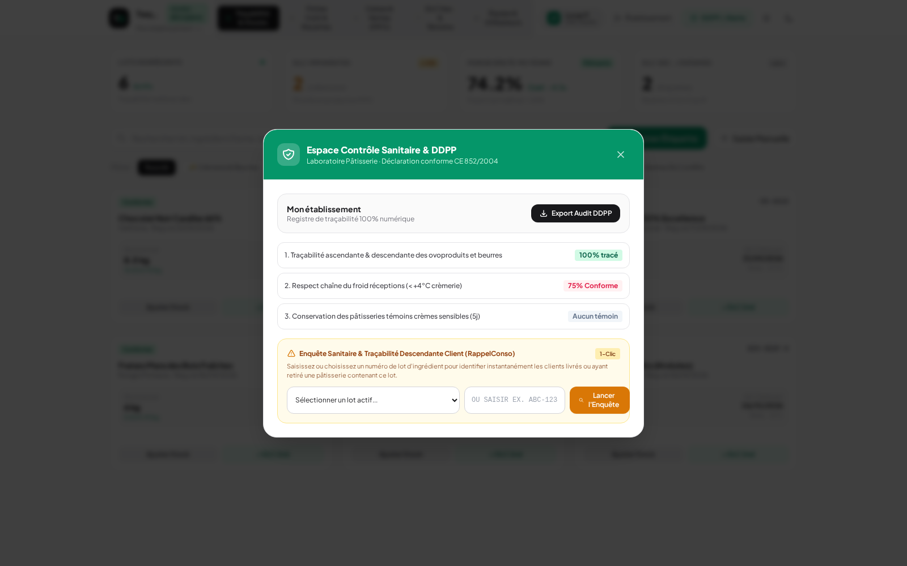

Le bouton **DDPP / Alerte** de la barre supérieure ouvre l'espace de contrôle : c'est **l'écran à montrer à l'inspecteur**.

### 12.1 Le rapport de contrôle en trois points

L'application présente d'elle-même les trois points qu'un inspecteur vérifie en premier :

1. **Traçabilité ascendante & descendante des ovoproduits et beurres** — affiche le taux de traçabilité atteint (objectif : 100 % tracé).
2. **Respect de la chaîne du froid à réception (< +4 °C crèmerie)** — affiche le pourcentage de lots conformes, avec les écarts à expliquer.
3. **Conservation des pâtisseries témoins pour les crèmes sensibles (5 jours)** — affiche l'état des témoins, lot par lot.

Le bouton **Export Audit DDPP** lance la constitution du rapport d'audit.

**Les deux exports du module produisent un vrai fichier PDF**, imprimable et archivable sans connexion :

- **Export Audit DDPP** → `traqhaccp-registre-sanitaire-<AAAA-MM-JJ>-<HHMM>.pdf`
  Le **Registre Sanitaire d'Établissement** complet, en sept sections : *1. Synthèse de conformité* (traçabilité amont/aval, chaîne du froid, DLC dérivées, échantillons témoins) · *2. Registre des réceptions et des stocks* · *3. Préparations secondaires — DLC dérivées* · *4. Échantillons témoins (conservation 5 jours)* · *5. Traçabilité descendante — déstockages clients* · *6. Opérateurs déclarés dans le registre* · *7. Mentions et signature*. Le document rappelle la durée de conservation réglementaire des enregistrements (3 ans minimum, règlement (CE) n° 852/2004).
- **Exporter Fiche d'Alerte DDPP (PDF)** → `traqhaccp-fiche-alerte-<N° LOT>-<AAAA-MM-JJ>-<HHMM>.pdf`
  La fiche du lot recherché : matière première, fournisseur, DLC, date de réception, **préparations intermédiaires à retirer de la vente** et **clients à prévenir**, suivis de la conduite à tenir.

Les deux documents sont en-têtés au nom de l'établissement (raison sociale, SIRET, n° d'agrément, adresse, responsable légal), repris de **Réglages → Établissement** (chapitre 15) : **renseignez cet écran dès la mise en service**, sinon les documents sortent avec la mention « établissement non renseigné ».

> 💡 Aucune cellule n'est tronquée : les libellés longs et les numéros de lot passent à la ligne, pour rester lisibles à l'écran comme à l'impression.

### 12.2 Enquête sanitaire et traçabilité descendante (le rappel produit)

C'est la fonction la plus précieuse de l'application : **savoir en une minute à quels clients un lot a été vendu**.

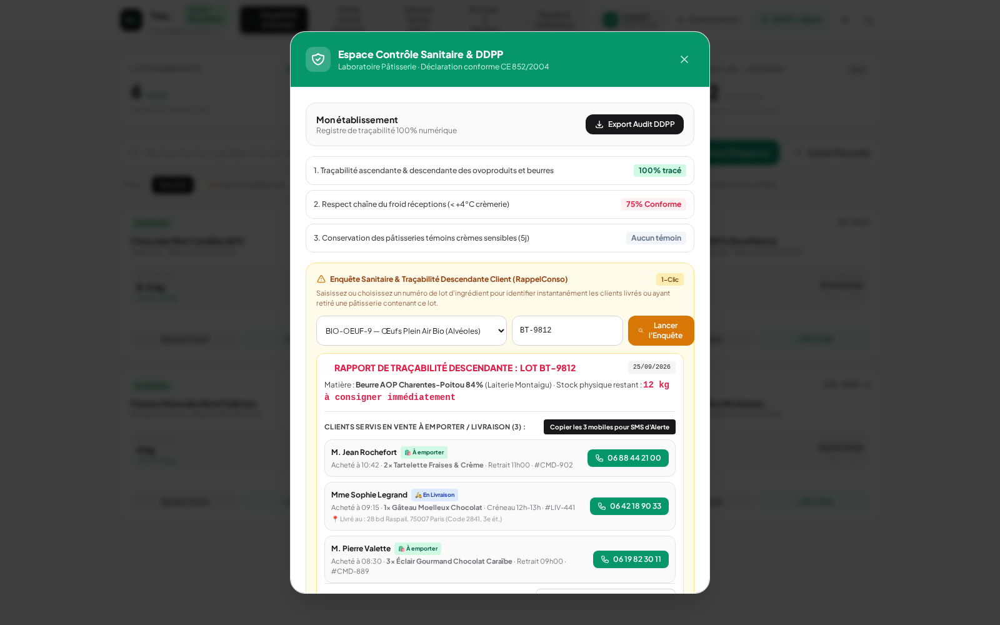

1. Dans l'encadré **Enquête Sanitaire & Traçabilité Descendante Client (RappelConso)**, saisissez un **numéro de lot** — ou choisissez-le dans la liste déroulante des lots actifs (ex. `BT-9812 — Beurre AOP Charentes-Poitou 84%`).
2. **Lancer l'Enquête**.
3. L'application produit le **Rapport de Traçabilité Descendante** : la matière, le fournisseur, la **date d'entrée du lot**, le **stock physique restant à consigner immédiatement**, et la **liste des clients servis** (nom, mode de vente, heure d'achat, produits et quantités, référence de commande, téléphone, éventuellement adresse de livraison).
4. Bouton **Copier les N mobiles** : tous les numéros partent dans le presse-papier, prêts à coller dans un SMS d'alerte groupé.
5. Bouton **Exporter Fiche d'Alerte DDPP (PDF)** : télécharge la **fiche d'alerte du lot** — le document à remettre au fournisseur, à transmettre à la DDPP ou à afficher en réserve (chapitre 12.1).

> **Le bon réflexe en cas d'alerte fournisseur** : lancement de l'enquête → copie des mobiles → SMS aux clients → consignation du stock restant → note du fournisseur classée avec la fiche. Comptez **moins de deux minutes**, au lieu d'un après-midi de recherche dans un cahier.

---

## 13. Équipe, rôles et codes PIN

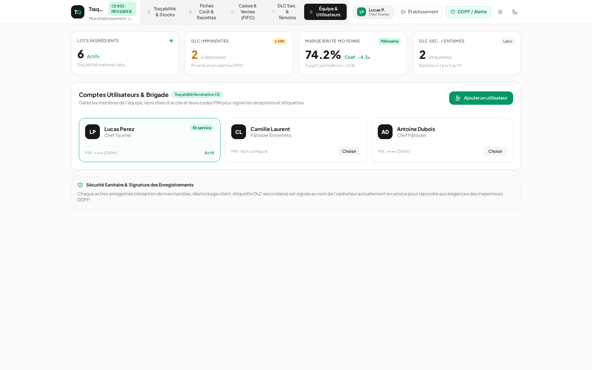

Chaque enregistrement est **signé du nom de l'opérateur en service** (réception, déstockage client, étiquette de DLC secondaire). C'est ce qui distingue le registre numérique d'un classeur anonyme.

### 13.1 Ajouter un membre de la brigade

1. Onglet **Équipe & Utilisateurs** → **Ajouter un utilisateur** (ou depuis la barre supérieure : **Opérateur → + Nouveau**).
2. Renseignez **Prénom**, **Nom**, **Rôle / Poste**, et si vous le souhaitez un **Code PIN de signature**.
3. **Créer l'utilisateur**.

Les cinq rôles proposés :

- **Chef Pâtissier / Gérant (Supervision & HACCP)**
- **Chef Tourrier (Pâtes, Tourage, Cuissons)**
- **Pâtissier Entremets & Finitions**
- **Apprenti / Commis (Nettoyage & Préparations)**
- **Responsable Vente & Caisse**

### 13.2 Codes PIN

- Le code PIN permet à l'opérateur de **signer** ses enregistrements (il n'est ni affiché, ni transmis, ni inclus dans les exports du registre).
- Un membre sans PIN apparaît avec la mention **« PIN : Non configuré »** et un bouton **Choisir** pour lui en attribuer un.
- Chaque carte de membre indique **En service**, **Actif**, et l'état du PIN (**•••• (Défini)** / **Non configuré**).

### 13.3 Changer d'opérateur en cours de service

**Barre supérieure → Opérateur** (initiales) → sélectionnez la personne active → fermez. Le nom affiché en haut de l'écran devient la signature des enregistrements suivants.

> **À faire à chaque prise de poste.** Le **Déconnexion** de cette même fenêtre ferme la session de l'appareil (utile sur un poste partagé en salle de vente).

---

## 14. Les réglages de l'établissement (8 onglets)

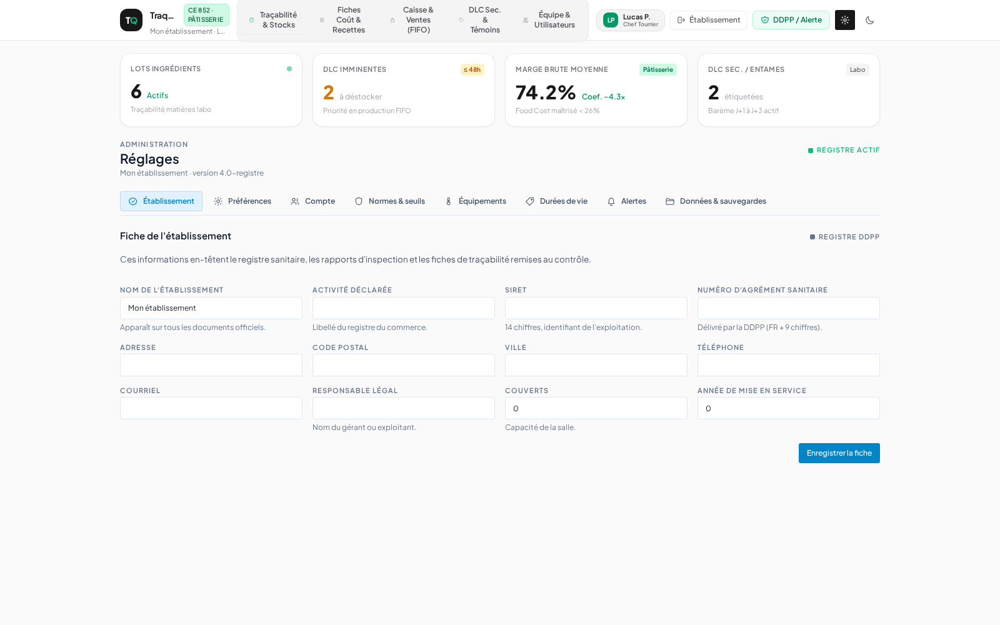

L'écran **Réglages** est divisé en huit onglets. Les trois premiers concernent l'administration, les cinq suivants la conformité et les données.

### 14.1 Établissement — la fiche officielle

Renseigne l'en-tête de tous les documents officiels : **nom de l'établissement**, activité déclarée, SIRET (14 chiffres), **numéro d'agrément sanitaire** (FR + 9 chiffres, délivré par la DDPP), adresse, code postal, ville, téléphone, courriel, **responsable légal**, nombre de couverts, année de mise en service.

→ **Enregistrer la fiche**. Ces informations en-têtent le registre sanitaire, les rapports d'inspection et les fiches de traçabilité remises au contrôle.

### 14.2 Préférences — confort d'usage

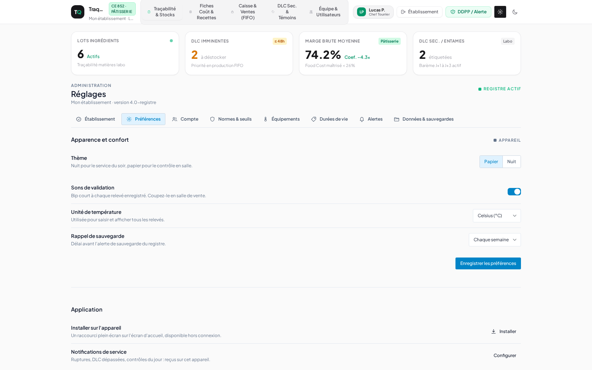

- **Thème** : *Papier* (clair) ou *Nuit* (sombre). « Nuit pour le service du soir, papier pour le contrôle en salle. »
- **Sons de validation** : bip court à chaque enregistrement — à couper en salle de vente.
- **Unité de température** : **Celsius (°C)** ou Fahrenheit (°F) — utilisée pour tous les relevés.
- **Rappel de sauvegarde** : chaque jour / semaine / mois (délai avant l'alerte de sauvegarde du registre).
- **Installer sur l'appareil** : raccourci plein écran, disponible hors connexion.
- **Notifications de service** : bouton **Configurer**.
- **Remettre les réglages à zéro** : thème, préférences et fiches reviennent aux valeurs livrées — **le registre sanitaire n'est jamais effacé**.

### 14.3 Compte — session, brigade, établissement

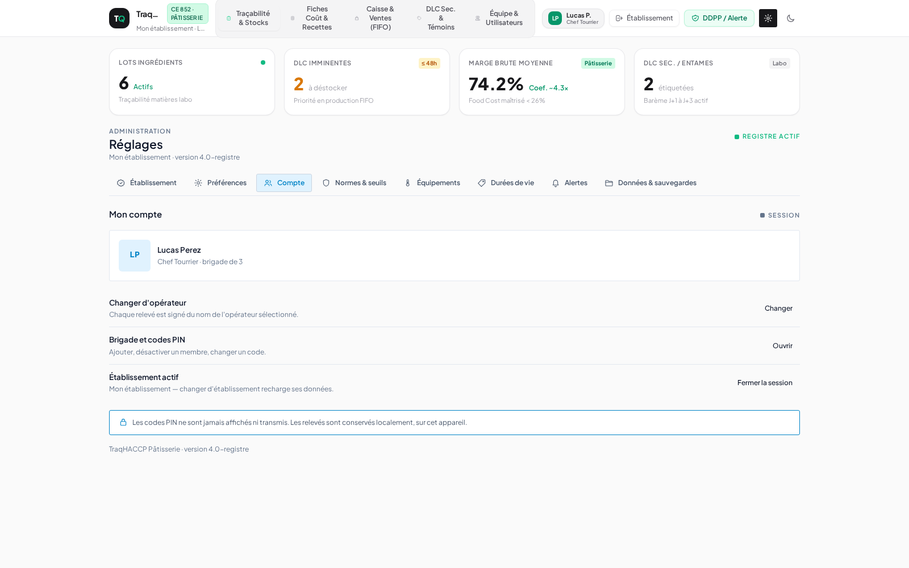

- **Changer d'opérateur** : « Chaque relevé est signé du nom de l'opérateur sélectionné. »
- **Brigade et codes PIN** → **Ouvrir** : ajouter, désactiver un membre, changer un code.
- **Établissement actif** : changer d'établissement recharge ses données.
- **Fermer la session**.

Rappel affiché : *les codes PIN ne sont jamais affichés ni transmis* et *les relevés sont conservés localement, sur cet appareil*.

### 14.4 Normes & seuils — le référentiel de contrôle

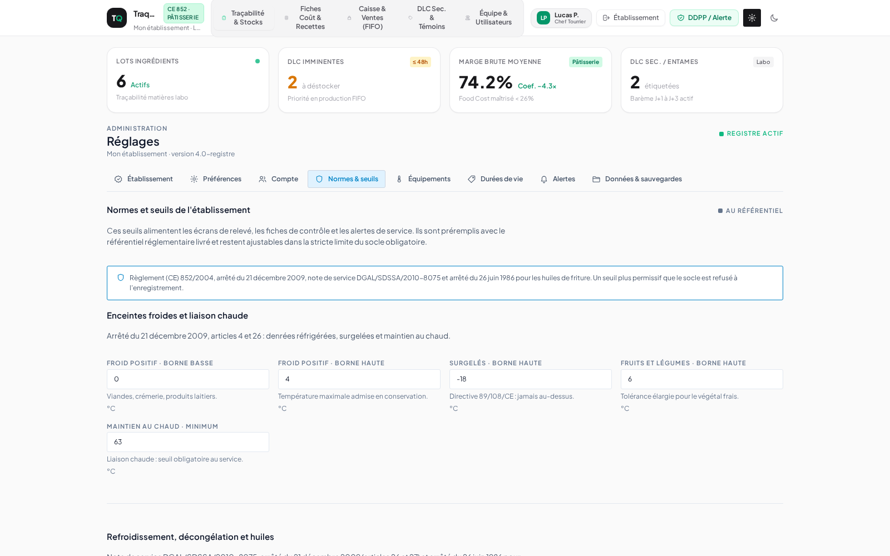

Trois blocs de seuils, préremplis avec le référentiel réglementaire livré :

- **Enceintes froides et liaison chaude** — froid positif borne basse et borne haute, surgelés borne haute, fruits et légumes borne haute, maintien au chaud minimum.
- **Refroidissement, décongélation et huiles** — départ, cible et durée maximale de refroidissement (règle des 2 heures), maximum de décongélation, délai après sortie, seuil d'alerte et seuil de rejet **TPM** des huiles, repos avant analyse.
- **pH, portionnement et conservation** — seuils du guide de bonnes pratiques.

**Règle capitale encadrée par l'application :** *un seuil plus permissif que le socle obligatoire est refusé à l'enregistrement*. Les valeurs et leurs références figurent en **annexe A**.

→ **Enregistrer**.

### 14.5 Équipements — le parc des enceintes

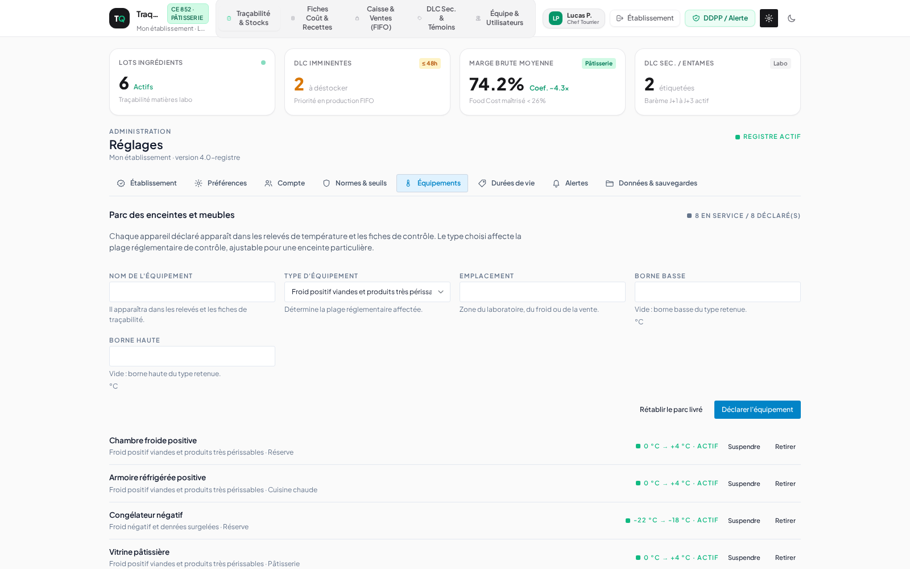

Liste les enceintes et meubles de l'établissement (compteur *X en service / X déclaré(s)*). Pour chaque appareil : **nom**, **type**, **emplacement**, **borne basse** et **borne haute** (si laissées vides, la plage réglementaire du type s'applique).

- **Rétablir le parc livré** : remet les 8 enceintes par défaut.
- **Déclarer l'équipement** : ajoute un appareil (nouvelle vitrine, seconde chambre froide…).
- Sur une ligne existante : **Suspendre** (hors service temporaire) ou **Retirer**.

Les types disponibles : *Froid positif viandes et produits très périssables*, *Froid positif fruits et légumes*, *Froid négatif et denrées surgelées*, *Liaison chaude et maintien au chaud*, *Poissons et produits de la mer sous glace*.

### 14.6 Durées de vie — le barème des DLC secondaires

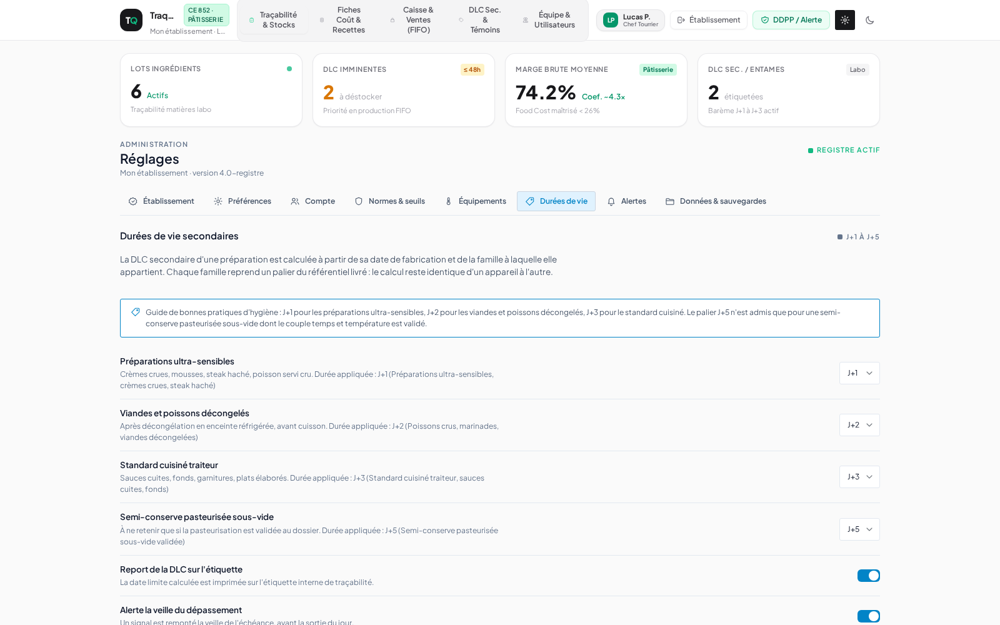

Quatre familles, chacune avec son palier réglable (J+1, J+2, J+3, J+5) :

- **Préparations ultra-sensibles** — crèmes crues, mousses, steak haché, poisson servi cru → **J+1**
- **Viandes et poissons décongelés** — après décongélation en enceinte réfrigérée, avant cuisson → **J+2**
- **Standard cuisiné traiteur** — sauces cuites, fonds, garnitures, plats élaborés → **J+3**
- **Semi-conserve pasteurisée sous-vide** — uniquement si la pasteurisation est validée au dossier → **J+5**

Deux rappels affichés en bas d'écran : *la date limite calculée est reportée sur l'étiquette interne de traçabilité* et *un signal est remonté la veille de l'échéance*. Le palier J+5 n'est admis **que** pour une semi-conserve pasteurisée sous-vide dont le couple temps/température est validé. **Toute durée de vie allongée doit être justifiée par une analyse de dangers et validée par le responsable.**

### 14.7 Alertes — ce que l'appareil signale

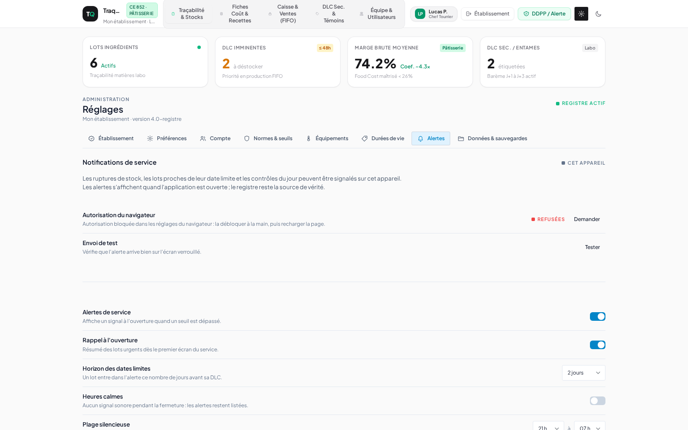

- **Autorisation du navigateur** : état de l'autorisation ; si elle est bloquée, il faut la débloquer dans les réglages du navigateur puis recharger la page → bouton **Demander**.
- **Envoi de test** → **Tester** : vérifie qu'une alerte arrive bien sur l'écran verrouillé du téléphone.
- **Alertes de service** : signal à l'ouverture quand un seuil est dépassé.
- **Rappel à l'ouverture** : résumé des lots urgents dès le premier écran du service.
- **Horizon des dates limites** : 24 heures / 2 jours / 3 jours / 1 semaine — délai avant la DLC à partir duquel un lot entre en alerte.
- **Heures calmes** : plage silencieuse (bornes horaires) pendant laquelle aucun signal sonore n'est émis — les alertes restent listées.

→ **Enregistrer les alertes**. Rappel affiché : *les alertes ne modifient jamais une donnée du registre*.

### 14.8 Données & sauvegardes

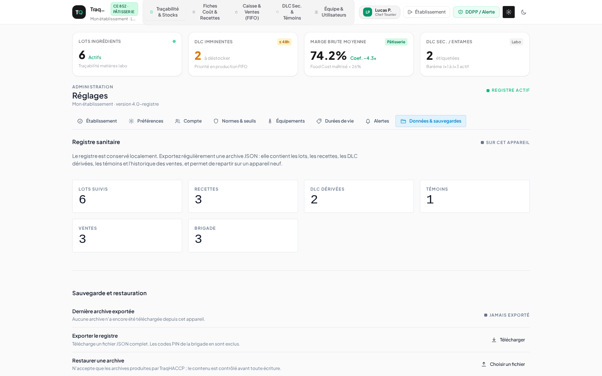

- **Compteurs du registre** : lots suivis, recettes, DLC dérivées, témoins, ventes, brigade.
- **Dernière archive exportée** : date du dernier export, ou **JAMAIS EXPORTÉ** (signal d'alerte à prendre au sérieux).
- **Exporter le registre → Télécharger** : télécharge une archive **JSON** complète (lots, recettes, DLC dérivées, témoins, historique des ventes). Les **codes PIN de la brigade en sont exclus**.
- **Restaurer une archive → Choisir un fichier** : n'accepte que les archives produites par TraqHACCP ; le contenu est contrôlé avant toute écriture, avec double confirmation.
- **Espace de stockage local** : volume occupé par le registre dans le navigateur.
- **Rythme du rappel de sauvegarde** : rappel configuré (ex. « chaque semaine ») → bouton **Voir les préférences**.
- **Cache de l'application** (hors-ligne) : état des fichiers précachés → **Vérifier**.
---

## 15. Couleurs, statuts et alertes

### 15.1 Les statuts de lot

| Apparence | Signification | Ce qu'il faut faire |
| --- | --- | --- |
| 🟢 **Conforme** | Lot dans les normes, DLC lointaine | Rien — production normale |
| 🟠 **DLC ≤ 48 h** | La date limite approche à moins de 48 heures | Priorité de production : écouler ce lot d'abord (FIFO) |
| 🔴 **DLC Urgente ≤ 24 h** | Échéance dans moins de 24 heures | À traiter aujourd'hui : produire, vendre ou retirer du service |
| ⚪ **DLC dépassée** | La date limite est passée | Retrait immédiat du service et du stock |

### 15.2 Les alertes de service

L'application signale trois familles d'événements :

- **Rupture de stock** — une matière manque pour la production prévue.
- **DLC proche ou dépassée** — messages du type : *« Crème Liquide 35% : à écouler avant le 21/09 »* ou *« Beurre AOP : date limite dépassée de 1 jour — à retirer du service. »*
- **Contrôles du jour** — ce que le registre attend encore aujourd'hui (réception non saisie, témoin manquant…).

Le message d'ouverture est un résumé : *« 2 alertes de service, dont 1 urgente. Ouvrez l'application pour les traiter. »*

**Trois réglages pilotent ces alertes** (Réglages → Alertes) : l'**horizon** (24 h, 2, 3 jours ou 1 semaine avant la DLC), le **rappel à l'ouverture**, et les **heures calmes** (aucun son pendant la fermeture, mais les alertes restent listées).

> **Important** — Les alertes sont émises **quand l'application est ouverte** (ou via la notification du navigateur si l'autorisation a été accordée et que la page tourne en arrière-plan). Le registre reste la source de vérité : une alerte non lue n'efface rien. Le bon réflexe d'ouverture de service : ouvrir TraqHACCP et lire le résumé.

---

## 16. Sauvegarde, restauration et usage hors connexion

### 16.1 Où vivent les données (à comprendre absolument)

Le compte établissement sert à identifier l'établissement et à ouvrir la session (comptes et habilitations gérés en ligne). En revanche, **les données du registre — lots, recettes, DLC, témoins, ventes, brigade — sont conservées dans le navigateur de l'appareil utilisé**, rattachées à l'identifiant de l'établissement. **La synchronisation du registre entre plusieurs postes n'est pas encore active** (chapitre 18). Trois conséquences pratiques :

1. **Le registre n'est pas encore synchronisé entre appareils.** Travailler sur deux postes en parallèle donne deux registres distincts. La règle de travail : **un appareil principal** par établissement (celui du laboratoire, ou une tablette dédiée).
2. **Vider les données du navigateur efface le registre.** Il faut donc exporter régulièrement (16.2).
3. **Pour transférer le registre** sur un nouvel appareil : exporter l'archive sur l'ancien, la restaurer sur le nouveau (16.3).

> ⚠️ **Réglage conseillé dès la mise en service** : *Réglages → Préférences → Rappel de sauvegarde* = **chaque semaine**, et l'habitude du vendredi soir : **exporter le registre** et déposer l'archive dans le dossier du laboratoire (clé USB, espace partagé, disque du bureau).

### 16.2 Exporter le registre (sauvegarde)

1. **Réglages → Données & sauvegardes**.
2. Encadré *Sauvegarde et restauration* → **Exporter le registre** → **Télécharger**.
3. Un fichier **JSON** est téléchargé (nom daté, ex. `traqhaccp-<etablissement>-<date>-<heure>.json`). Il contient les **lots, recettes, DLC dérivées, témoins et l'historique des ventes**, **sans les codes PIN** de la brigade.
4. Rangez-le hors de l'appareil : c'est votre seule copie de sécurité.

L'écran affiche aussi la **date de la dernière archive exportée** — si vous lisez **JAMAIS EXPORTÉ**, c'est qu'aucune sauvegarde n'existe.

### 16.3 Restaurer une archive

1. **Réglages → Données & sauvegardes** → *Restaurer une archive* → **Choisir un fichier**.
2. Sélectionnez l'archive `.json` : l'application **contrôle son contenu** avant toute écriture et demande une **double confirmation**.
3. Les données de l'archive remplacent le contenu du registre de l'appareil.

> Une archive douteuse, modifiée ou d'un autre logiciel est refusée. C'est voulu : un registre sanitaire ne doit pas pouvoir être corrompu par un fichier inconnu.

### 16.4 Utilisation hors connexion

Après une première ouverture en ligne, l'application met ses fichiers en cache : elle **continue de fonctionner sans réseau** (consultation et saisie). Vérifiez l'état du cache dans *Données & sauvegardes → Hors-ligne → Vérifier*.

> Les écritures faites hors connexion restent sur l'appareil. **Sauvegardez par export** avant tout changement d'appareil.

### 16.5 Durée de conservation

Le règlement (CE) n° 852/2004 (annexe II, chapitre IX) impose de conserver les enregistrements **au minimum 3 ans** ; la valeur appliquée par l'application est réglable dans **Normes & seuils** (3 ans minimum, 30 ans maximum). Concrètement : **cumulez les archives JSON exportées**, année par année — c'est votre archive légale.

---

## 17. Dépannage : les 10 questions les plus fréquentes

**1. J'ai ouvert l'application sur un second appareil : je ne vois pas mes lots.**
Le registre est **local à l'appareil** dans cette version. Solution : exporter l'archive depuis l'appareil principal (Réglages → Données → Télécharger) puis la restaurer sur le second. Ne saisissez pas sur deux appareils en parallèle.

**2. Mon registre est vide : aucun lot, aucune recette. Est-ce une panne ?**
Non. Un établissement nouvellement créé démarre avec un **registre vide** : les lots apparaissent à la première réception (chapitre 7), la brigade se crée dans **Équipe & Utilisateurs** (chapitre 13), les fiches recettes sont livrées à la mise en service. Si vous attendiez des données déjà saisies, vérifiez d'abord que vous travaillez **sur le bon appareil** : le registre est propre à chaque poste (chapitre 16.1) — restaurez au besoin une archive (chapitre 16.3).

**3. Je ne reçois aucune alerte sur mon téléphone.**
Trois vérifications, dans l'ordre : (a) Réglages → **Alertes** → *Autorisation du navigateur* : si elle est **REFUSÉE**, cliquez **Demander** et autorisez dans le navigateur, puis rechargez la page ; (b) cliquez **Tester** (envoi de test) ; (c) vérifiez que vous n'êtes pas dans la **plage des heures calmes** et que l'**horizon des dates limites** n'est pas réglé trop court (24 h). Rappel : les alertes s'affichent quand l'application est ouverte.

**4. Un lot est passé en rouge « DLC Urgente ». Que faire ?**
C'est une information de travail, pas une panne : le lot doit être écoulé aujourd'hui ou retiré du service. Utilisez le filtre **Alertes DLC (≤48h)** pour traiter le sujet en fin de service.

**5. Je me suis trompé dans une quantité (réception ou déstockage).**
Ne supprimez pas : **corrigez par ajustement**. Carte du lot → **Ajuster Stock** → saisissez le *nouveau stock réel pesé* → **Enregistrer**. L'ajustement est daté et signé. C'est exactement ce qu'un inspecteur attend (une correction tracée vaut mieux qu'un chiffre parfait).

**6. J'ai oublié le code PIN d'un opérateur.**
Les codes PIN **ne sont jamais affichés ni transmis** : ils ne sont pas récupérables. Ouvrez **Équipe & Utilisateurs** → carte du membre → **Choisir** pour lui attribuer un **nouveau** PIN.

**7. Un membre ne s'affiche pas comme opérateur disponible.**
Vérifiez son état sur sa carte : s'il est désactivé, réactivez-le depuis **Équipe & Utilisateurs** (ou Réglages → Compte → **Brigade et codes PIN → Ouvrir**).

**8. Le bouton « Nouvelle Fiche Recette » ne crée rien.**
Vérifiez les deux champs obligatoires (**Nom de la Pâtisserie** et **Prix de vente TTC**) et la composition : une ligne d'ingrédient n'est enregistrée que si elle associe un **lot**, un **nom** et une **quantité supérieure à 0** (chapitre 10.4). Si le formulaire reste bloqué après une mise à jour de l'application, **rechargez la page** (Ctrl+F5, ou fermez et rouvrez la PWA installée) : le navigateur a pu conserver l'ancienne version en cache.

**9. « Export Audit DDPP » ne télécharge pas de fichier.**
Le PDF est bien produit : vérifiez que le navigateur **n'a pas bloqué le téléchargement** (icône de blocage dans la barre d'adresse, ou autorisation « Téléchargements » sur tablette) et que l'appareil dispose d'espace libre. Le document part dans **Téléchargements** (ou **Fichiers** sur iPad). En cas de doute, le rapport reste consultable à l'écran : présentez-le à l'inspecteur et remettez l'**archive JSON** du registre (chapitre 16.2).

**10. Le scan d'étiquette ne remplit pas le formulaire.**
L'application vous a affiché un message d'information, puis ouvert le formulaire vide : c'est le comportement prévu lorsque l'analyse d'images n'est pas disponible. Trois causes, dans l'ordre de fréquence : **(a)** la clé d'analyse d'images n'est pas configurée sur l'hébergement — le message le dit explicitement (« *Clé API Gemini non configurée sur le serveur* »), c'est l'état actuel de l'installation (chapitre 18) ; **(b)** la photo est inexploitable (floue, de biais, reflet, étiquette froissée) — recadrez la zone **lot + DLC** et recommencez ; **(c)** le navigateur n'a pas l'autorisation d'utiliser l'appareil photo. Dans les trois cas, la **saisie manuelle (chapitre 7) produit exactement le même registre** : dix secondes de plus, rien de moins.

**Bonus — La remise à zéro des réglages efface-t-elle mon registre ?**
Non. *Préférences → Remettre les réglages à zéro* ne touche que le thème, les préférences et les fiches livrées. **Le registre sanitaire n'est jamais effacé** par cette action. Seuls l'effacement des données du navigateur ou une restauration d'archive modifient le registre.

---

## 18. Ce que cette version ne fait pas encore

Pour éviter toute promesse non tenue devant un client, un fournisseur ou un inspecteur :

- **Pas de synchronisation du registre entre appareils** : les comptes utilisateurs et l'identification de l'établissement sont gérés en ligne, mais les données du registre (lots, recettes, DLC, témoins, ventes, brigade) restent propres à chaque appareil — le transfert se fait par archive JSON (chapitre 16).
- **Pas d'export PDF de l'étiquette thermique** : le rapport d'audit DDPP et la fiche d'alerte s'exportent désormais en PDF (chapitre 12.1), mais l'étiquette thermique ne produit pas de fichier — le bouton « Imprimer Étiquette Thermique » **enregistre la DLC secondaire** sans piloter d'imprimante.
- **Reconnaissance d'étiquette à activer sur l'hébergement** : le module de scan (photo → analyse → formulaire pré-rempli, chapitre 11.1) est **livré et fonctionnel**, mais il dépend d'une **clé d'analyse d'images côté serveur**. Tant qu'elle n'est pas configurée, l'application le dit elle-même (« *Clé API Gemini non configurée sur le serveur* ») et ouvre le formulaire vide : la saisie manuelle (chapitre 7) reste alors la méthode de travail. Il s'agit d'un confort de saisie, **jamais d'un blocage** : le registre produit est identique dans les deux cas.
- **Pas d'écran de relevés de température** au quotidien : la température est relevée **à réception** (champ obligatoire du formulaire de lot) ; les équipements et les plages réglementaires servent de référentiel de contrôle.
- **Pas d'allergènes, de plan de nettoyage ni de traçabilité DLC au niveau du produit fini** : le suivi des allergènes du référentiel (14 allergènes INCO) n'est pas encore exposé dans l'interface.

Ces points sont des développements prévus, pas des défauts de conformité du registre : les enregistrements réellement exigés en contrôle (réception, températures de réception, DLC, témoins, ventes nominatives, rappel produit) sont bien couverts.

---

## Annexe A — Référentiel réglementaire et seuils livrés

Ces valeurs sont préremplies dans **Réglages → Normes & seuils**. Un seuil plus permissif que ce socle est **refusé** à l'enregistrement ; les messages de refus sont explicites (ex. *« Maintien au chaud : 63 °C est le minimum réglementaire »*).

**Enceintes froides et liaison chaude** — Arrêté du 21 décembre 2009, articles 4 et 26

- Froid positif — borne basse **0 °C**
- Froid positif — borne haute **+4 °C** (viandes, crémerie, produits laitiers)
- Surgelés — borne haute **−18 °C** (Directive 89/108/CE, décret 64-949)
- Fruits et légumes — borne haute **+6 °C** (tolérance élargie pour le végétal frais)
- Maintien au chaud — minimum **+63 °C** (liaison chaude, seuil obligatoire au service)

**Refroidissement, décongélation et huiles** — Note de service DGAL/SDSSA/2010-8075, arrêté du 21 décembre 2009 (articles 26 et 27), arrêté du 26 juin 1986

- Refroidissement — départ **+63 °C** (sortie de cuisson)
- Refroidissement — cible **+10 °C** (en cellule)
- Refroidissement — durée maximale **2 heures** (règle des 2 heures)
- Décongélation — maximum **+4 °C** (en enceinte réfrigérée)
- Décongélation — délai après sortie **24 heures** (consommation rapide ; palier J+1 du GBPH)
- Huiles — seuil d'alerte **20 % TPM** (surveillance renforcée)
- Huiles — seuil de rejet **24 % TPM** (rejet obligatoire ; **seuil légal 25 %**, l'application est plus stricte : 24 % maximum, valeurs au-delà refusées)
- Huiles — repos avant analyse **8 heures**

**pH, portionnement et conservation** — Guide de bonnes pratiques d'hygiène et règlement (CE) n° 852/2004

- pH — borne basse **2** (acidité forte : marinades, conserves acides)
- pH — borne haute **7** (neutralité alimentaire courante)
- Pertes au portionnement — alerte **10 %** (écart entre poids théorique et pesée)
- Conservation des enregistrements — **3 ans minimum** (annexe II, chapitre IX)

**Durées de vie secondaires (DLC)** — Guide de bonnes pratiques d'hygiène

- Préparations ultra-sensibles (crèmes crues, mousses, steak haché, poisson servi cru) — **J+1**
- Viandes et poissons décongelés (avant cuisson) — **J+2**
- Standard cuisiné traiteur (sauces cuites, fonds, garnitures, plats élaborés) — **J+3**
- Semi-conserve pasteurisée sous-vide — **J+5**, uniquement si le couple temps/température est validé au dossier
- Échantillon témoin — **100 g conservés 5 jours à +3 °C**

---

## Annexe B — Glossaire métier

- **DLC (date limite de consommation)** — date après laquelle une denrée ne peut plus être vendue ni servie. Un « J+3 » signifie : date de fabrication + 3 jours.
- **DDM (date de durabilité minimale)** — ancienne « DLUO », date de qualité optimale (produits secs, farines, chocolats).
- **DLC secondaire** — DLC recalculée après entame, décongélation ou cuisson d'une matière première ; c'est elle qui s'applique à la préparation.
- **Témoin sanitaire** — échantillon de 100 g conservé 5 jours au froid, prélevé sur les crèmes et préparations sensibles, utilisé en cas de suspicion d'intoxication.
- **FIFO (first in, first out)** — on consomme d'abord le lot le plus ancien / dont la DLC est la plus proche.
- **Food cost (FC)** — part de la matière première dans le prix de vente HT, en pourcentage.
- **Coefficient multiplicateur** — prix de vente TTC divisé par le coût matière ; repère artisan : 3,8x à 5,0x.
- **Fabricables** — nombre de pièces réalisables avec le stock actuel.
- **Traçabilité ascendante** — remonter du produit vendu vers le fournisseur et le lot fabricant.
- **Traçabilité descendante** — descendre du lot fabricant vers les clients qui ont reçu le produit (rappel produit).
- **TPM (composés polaires totaux)** — indicateur d'usure de l'huile de friture ; au-delà du seuil légal, l'huile doit être jetée.
- **GBPH** — Guide de bonnes pratiques d'hygiène, référence professionnelle validée par les autorités.
- **Agrément sanitaire** — autorisation délivrée par la DDPP pour certaines activités (numéro FR + 9 chiffres), à saisir dans la fiche établissement.
- **DDPP** — Direction départementale de la protection des populations, autorité de contrôle.
- **HACCP** — système d'analyse des dangers et de maîtrise des points critiques : la méthode qui fonde ce registre.

---

## Annexe C — Mémo d'une page à afficher en laboratoire

**À CHAQUE LIVRAISON** (3 min)

1. Thermomètre : relever la température de chaque produit frais/surgelé.
2. Traçabilité & Stocks → **Saisie Manuelle** : catégorie, fournisseur, désignation, **n° de lot fabricant**, quantité + unité, prix HT, **température**, **DLC fabricant**.
3. **Valider et Entrer en Stock**. Hors seuil : refuser la marchandise, le signaler au fournisseur.

**À CHAQUE PRÉPARATION SORTIE DU LABO** (1 min)

1. Entame, décongélation ou cuisson → **DLC Sec. & Témoins** → **Nouvelle DLC Secondaire** → rattacher le **lot mère** → choisir le **type d'opération** (J+1 dé congélation · J+3 entame et cuisson · J+5 sous-vide validé) → valider.
2. Crème pâtissière, ganache, préparation sensible servie → **Enregistrer Échantillon** (100 g, service/fournée, température d'enceinte).

**À CHAQUE VENTE** (30 s)

1. **Caisse & Ventes** → **Vendre & Déstocker**.
2. Canal (à emporter / livraison), **nom du client**, **téléphone**, heure de retrait ou adresse + référence de commande.
3. Valider : le stock part en FIFO (DLC la plus proche).

**FIN DE SERVICE** (5 min)

1. Filtre **Alertes DLC (≤48h)** : ce qui doit partir demain.
2. Casse, coulure, écart de pesée → **Ajuster Stock** (le jour même).
3. **Réglages → Données & sauvegardes → Télécharger** : une archive par semaine minimum.

**EN CAS D'ALERTE FOURNISSEUR** (2 min)

1. **DDPP / Alerte** → **Enquête Sanitaire** → saisir le **n° de lot fabricant** → **Lancer l'Enquête**.
2. **Copier les mobiles** → SMS d'alerte aux clients de la liste.
3. Stock restant du lot : consigné, retiré du service.

**EN CONTRÔLE DDPP**

1. Bouton **DDPP / Alerte** : les trois points de contrôle et les taux de conformité.
2. Bouton **Export Audit DDPP** : remettez le **PDF du Registre Sanitaire d'Établissement** (chapitre 12.1) ; en cas d'alerte, **Exporter Fiche d'Alerte DDPP (PDF)** pour le lot concerné.
3. Archive JSON du registre exportée le jour même (sauvegarde complète, chapitre 16.2).
4. Fiche établissement à jour (Réglages → Établissement) : SIRET, agrément, adresse, responsable légal — c'est l'en-tête imprimé des deux PDF remis.

---

*TraqHACCP — Pâtisserie · version 4.0-registre · Guide utilisateur. Ce document décrit le comportement de l'application telle que livrée ; il ne remplace pas le plan de maîtrise sanitaire de l'établissement, dont il constitue l'outil d'enregistrement.*
